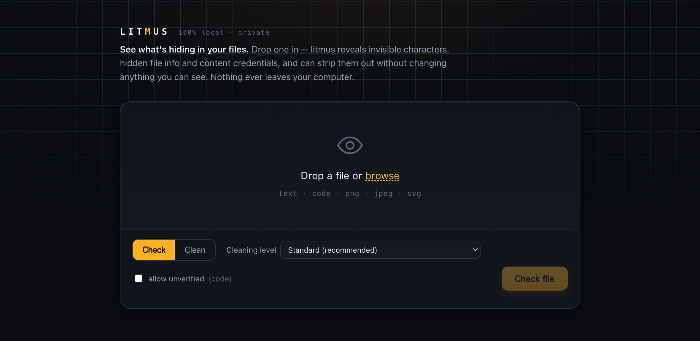

# litmus

**See what's hiding in your files — and remove it, safely.**



litmus is a private, fully local tool that reveals invisible characters, hidden
file information and content credentials in your documents, code and images —
then strips them out without changing anything you can see. Every clean-up is
checked before it is saved: if a change cannot be confirmed safe, litmus keeps
your original untouched.

- **Check** — see what's hidden: invisible characters, embedded file info, content credentials
- **Clean** — remove it, while what you see stays exactly the same
- **Trust** — nothing is saved unless the result is verified safe
- **Private** — 100% offline; your files never leave your machine

Works with text, source code, PNG, JPEG and SVG files.

## Get started in one minute

```bash
git clone https://github.com/LastDev-coder/litmus
cd litmus
./start.sh          # macOS / Linux
./start.ps1         # Windows (PowerShell)
```

That's the whole setup — it prepares everything and opens the app in your
browser. Drop a file in, choose **Check** or **Clean**, and download the clean
result. Requires Python 3.11+ (or [uv](https://docs.astral.sh/uv/), which
fetches Python for you).

## Using the app

1. **Drop a file** onto the page.
2. **Check** shows what's hiding inside, explained in plain language.
3. **Clean** removes it and hands you the cleaned file. Your original is never
   modified.

Pick a cleaning level to control how much is done:

| Level | What it does |
|---|---|
| Minimal | Remove invisible characters only |
| Standard *(default)* | Also normalize unusual spaces, line endings and letterforms |
| Tidy | Also neaten extra blank lines |
| Code-aware | Also remove unused Python imports |

## Command line

Prefer a terminal? After setup, the same features are available as commands:

```bash
source .venv/bin/activate

litmus inspect myfile.txt        # what's hidden? (read-only)
litmus transform myfile.txt      # print the cleaned version
litmus transform myfile.txt --in-place --backup   # save it, keep a .bak
litmus serve                     # open the web app
litmus --help                    # everything else
```

For source-code files, litmus is deliberately strict: it saves a cleaned code
file only when it can verify the program still behaves the same. If it can't
verify, it refuses and tells you why.


## What litmus won't claim

Honesty is the point of this tool, so two limits are stated up front:

- litmus finds *hidden content* — it does **not** detect statistical AI
  watermarks in plain text (no public tool can), and it never labels a file
  "AI-generated" or "human-written".
- Finding nothing is not proof there is nothing. litmus reports only what it
  can actually verify.

## Privacy

Everything runs on your machine. No accounts, no uploads, no telemetry, no
network access. The web app binds to `127.0.0.1` and analyses files in memory.

## License

[MIT](LICENSE)
